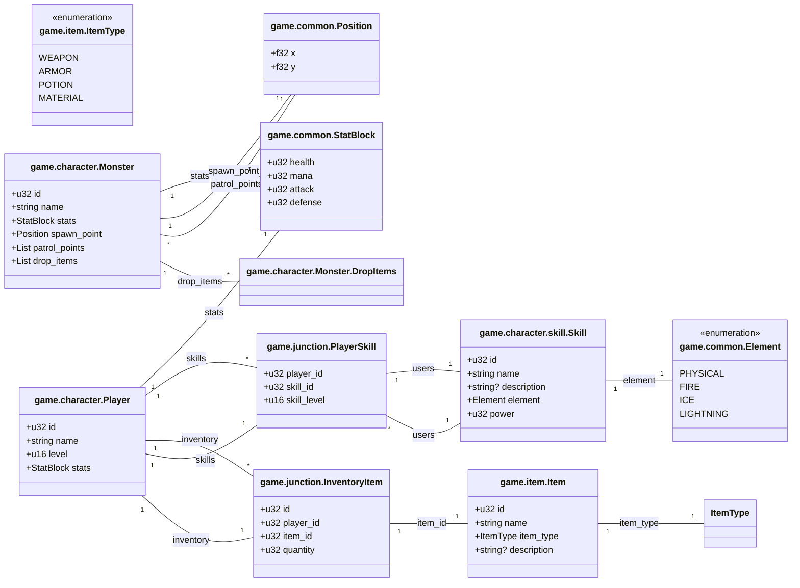

```mermaid
classDiagram
direction LR


class game.common.Element {
    <<enumeration>>
    PHYSICAL
    FIRE
    ICE
    LIGHTNING
    
}

class game.item.ItemType {
    <<enumeration>>
    WEAPON
    ARMOR
    POTION
    MATERIAL
    
}


class game.common.Position {
    +f32 x
    +f32 y
    
}

class game.common.StatBlock {
    +u32 health
    +u32 mana
    +u32 attack
    +u32 defense
    
}

class game.item.Item {
    +u32 id
    +string name
    +ItemType item_type
    +string? description
    
}

class game.character.Player {
    +u32 id
    +string name
    +u16 level
    +StatBlock stats
    
}

class game.character.Monster {
    +u32 id
    +string name
    +StatBlock stats
    +Position spawn_point
    +List<Position> patrol_points
    +List<DropItems> drop_items
    
}

class game.character.skill.Skill {
    +u32 id
    +string name
    +string? description
    +Element element
    +u32 power
    
}

class game.junction.PlayerSkill {
    +u32 player_id
    +u32 skill_id
    +u16 skill_level
    
}

class game.junction.InventoryItem {
    +u32 id
    +u32 player_id
    +u32 item_id
    +u32 quantity
    
}

game.item.Item "1" -- "1" ItemType : item_type
game.character.Player "1" -- "1" game.common.StatBlock : stats
game.character.Monster "1" -- "1" game.common.StatBlock : stats
game.character.Monster "1" -- "1" game.common.Position : spawn_point
game.character.Monster "*" -- "1" game.common.Position : patrol_points
game.character.Monster "1" -- "*" game.character.Monster.DropItems : drop_items
game.character.skill.Skill "1" -- "1" game.common.Element : element
game.junction.PlayerSkill "1" -- "1" game.character.Player : skills
game.junction.PlayerSkill "1" -- "1" game.character.skill.Skill : users
game.junction.InventoryItem "1" -- "1" game.character.Player : inventory
game.junction.InventoryItem "1" -- "1" game.item.Item : item_id
game.character.Player "1" -- "*" game.junction.PlayerSkill : skills
game.character.skill.Skill "1" -- "*" game.junction.PlayerSkill : users
game.character.Player "1" -- "*" game.junction.InventoryItem : inventory

```